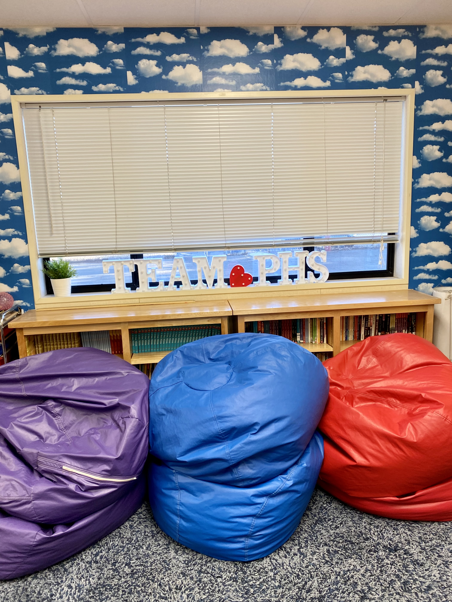

# Educational Technology Plan

The purpose of my educational technology plan is to design a diagram for a future **Introduction to Computer Science** course to be taught as an elective for *grade nine*. Currently, freshmen take an Integrated Technology / Career Education hybrid course that touches on the basics of technology.  The idea is that a new computer science course would be an elective course for those students interested in sampling or diving deeper into computer science. As it is an introductory course and equity is important, I will not require a prerequisite in the way of coursework or GPA.

## Context

### Course

Course Description: Introduction to Computer Science for grade nine will be an elective course designed to develop computational thinking and build student excitement
about computing. In addition to learning about programming and algorithms, students will build career awareness about
computing skills that can be applicable to various fields. Students will also improve their knowledge and skill with regard to ethics, safety, and
security on the Internet.

### Situation

I teach at Paradise High School in Paradise, California - located in Butte County. Most of our town was destroyed in the Camp Fire on November 8, 2018. Along with the emotional scars, the population was also devastated financially. Many families still live in trailers on their empty home lots or reside in other means of sub-par housing while rebuilding their homes or waiting to do so. Many do not have internet access or computers.  All work expectations for this course will be for school hours on campus.

## Plan

### Software Specifications

Due to hardware limitations, the course will be taught using entirely web-based platforms.  The classroom is currently limited to chromebooks, so I have chosen web-based platforms with limited requirements for accessibility. The following are the specifications of each which have slight variations.

#### Google Classroom: 
Google Classroom is your all-in-one place for teaching and learning with an easy-to-use and secure tool that helps educators manage, measure, and enrich learning experiences. 

Google Classroom supports the following browsers:

- Chrome 
- Firefox 
- Safari

#### Scratch: 
Scratch promotes computational thinking and problem solving skills; creative teaching and learning; self-expression and collaboration; and equity in computing.

Scratch supports the following browsers:

- Chrome 63+ or Mobile Chrome 63+
- Edge 15+
- Firefox 57+
- Safari 11+ or Mobile Safari 11+

#### Clever:
The Clever browser extension is the key to making sure your SSO (Saved Passwords) applications work properly whether students are accessing Clever from school, home, or both.

Clever supports the following operating systems and browsers:

Devices

- Microsoft Windows
- MacOS
- Chrome OS (Chromebooks)

Browsers: 

- Chrome
- Microsoft Edge
- Firefox

#### CodeHS: 
CodeHS is a comprehensive platform for helping schools teach computer science by providing web-based curriculum, teacher tools and resources, and professional development. With CodeHS, teachers have access all of the tools they need in one place, such as a customizable gradebook, progress tracking, and detailed lesson plans.

CodeHS supports the following operating systems and browsers:

Devices

- Microsoft Windows
- MacOS
- Chrome OS (Chromebooks)

Browsers:

- Chrome
- Microsoft Edge
- Firefox

#### Aeries: 
Aeries’ robust gradebook allows educators to spend more time teaching and less time doing paperwork.

Aeries supports the following browsers:

- Chrome
- Microsoft Edge
- Firefox
- Safari (Mac and iOS)

### Hardware Specifications

*Student Computers: (36 in classroom cart)*

**Chromebook 3100 2-in-1 Education**

- Intel Celeron N4020
- 4GB 2400MHz LPDDR4 Non-ECC
- 32GB eMMC Hard Drive
- Chrome OS

*Teacher Computer: (1)*

**Dell Latitude 5510 Laptop**

- 10th Generation Intel® Core™ i7-10810U
- 16 GB, 1X16 GB 3200MHz DDR4 Non-ECC
- 4GB DDR3 SDRAM 1333Mhz - 2 DIMMS
- OSWindows 10 Home

### Application

BACKGROUND: The technology listed above is what the district currently has in stock and what is available in my classroom. Since this is a proposed class and not a currently functioning course, there is a possibly of obtaining other computers, in the future, if the need dictated it and if the district had the ability to make the purchase.  For now, I believe the chromebooks will be suitable for students to access beginning course materials.  I will be using accesssible websites and will not require specific machine requirements.  Some students may have computers at home, but many will not. Internet service has not been completely restored in an effective manner throughout town, so even if students have computers, internet service isht  not reliable.  For these reasons, the expectations are that all work can be done in class. 

OVERVIEW: It would be important, in a new computer science course, to generate interest from the outset.  While beginning with the basics of terminology, ethics, and safety, I would also incorporate short and engaging Scratch assignments.  Scratch will allow learners to have an immediate sense of what they are creating and provide a platform that is easy to troubleshoot.  The final section of the course will be conducted in Python as students begin to scaffold on the terminology and skills they've learned and built in the early sections of the course.

DAILY: Most instruction will be conducted through active learning.  My students will be engaged in the learning process when they are a part of it.  I will use a number of different teaching strategies to avoid strictly passive learning.  Although there will be reading to do, that is something that can be done as homework.  All the interaction and projects can be classwork, saving individual reading and research for a time when peers and computers are not available.  In class, I will begin projects by outlining the big picture using slides and whole class discussion.  

The progression of assignment types will be important.  I will use problets after discussion as a beginning quick check to allow students to practice the skills they have just learned when I am immediately available for feedback.  Once the student has obtained a level of confidence, we will be able to merge into labs that could take the full class period or projects that will continue over a number of days.  The important things is that skills are scaffolded along with my engagement in the students' progress.  They will need my assistance more in the beginning stages and they will gradually be able to work more independently as they gain skills and knowledge and begin to think critically about the concepts.

Besides using the coding websites for IDE, I will use Google Classroom to post assignments and keep all information in one place.  This will allow students to stay organized and keep track of units, assignments, and other various materials presented.  It can also be used as a message board if I allow student comment on assignments and on the stream.  I sometimes use the Google Question feature if I want students to respond to a question and then respond to their peers. I will keep Clever bookmarked on Google Classroom so that students can access our other websites through Clever and make use of the SSO function it allows for the district.  Lastly, grades will all be transferred to Aeries which is already utilized in the district.  Staff, parents, and students all have access.

### Impacts

It is important that all students have the ability to learn in this course. When we were on distance learning, students were able to check out a Chromebook to use at home.  When we returned to campus, those Chromebooks were turned back into the district. Many students do not have a personal computer. For these reasons, I will be conducting all instruction, modeling, work time, and assessments within the class period on campus. If we were to go back on distance learning, the district would again check out Chromebooks for students to use at home.  In that scenario, class instruction would occur via scheduled Zoom sessions and assignments would be listed and linked on Google Classroom (as they would be for in-person instruction as well.)

Regardless of whether we are in person or remote, I will use evidence based practices as we work together on the basics of the problem and then break up into groups for peer instruction.  Later during projects, we will come back together to share out solutions.  Another strategy to incorporate will be pair programming.  This will allow students to take turns as the "driver" and the "navigator" and practice these abilities in projects.  Our district will check out a chromebook to any student in need and I will ask that they do so if a student would like to work at home as well as at school.  We will also check out a hot spot for areas that do not have current internet services. 

From the teacher's perspective, I will need to be cognizant not to expect a previous background connection from my learners and instead, I will need to initially teach the basics with clear definitions of terms and practices, avoiding extraneous information that would only overload the learner.  My strategies will be research based methods with a mix of audio and visual methods. While many students nationwide have not been in a typical learning environment since the pandemic began, Paradise students had their education interrupted before that.  It will be exceptionally important that I follow evidence based practices to scaffold effectively.  

Paradise has endured quite a few tough years.  After the fire in 2018, the community worked very hard to rally back.  Because of the widespread devastation, rebuilding was slow and many were still in temporary housing situations when Covid hit.  This added an additional financial blow to the town and its residents.  Still, houses are currently being built and the townspeople are resilient.  Our students deserve a computer science education that will give them the skills they need to survive and thrive as they move through high school, graduate, and move on to colleges and the work force.

